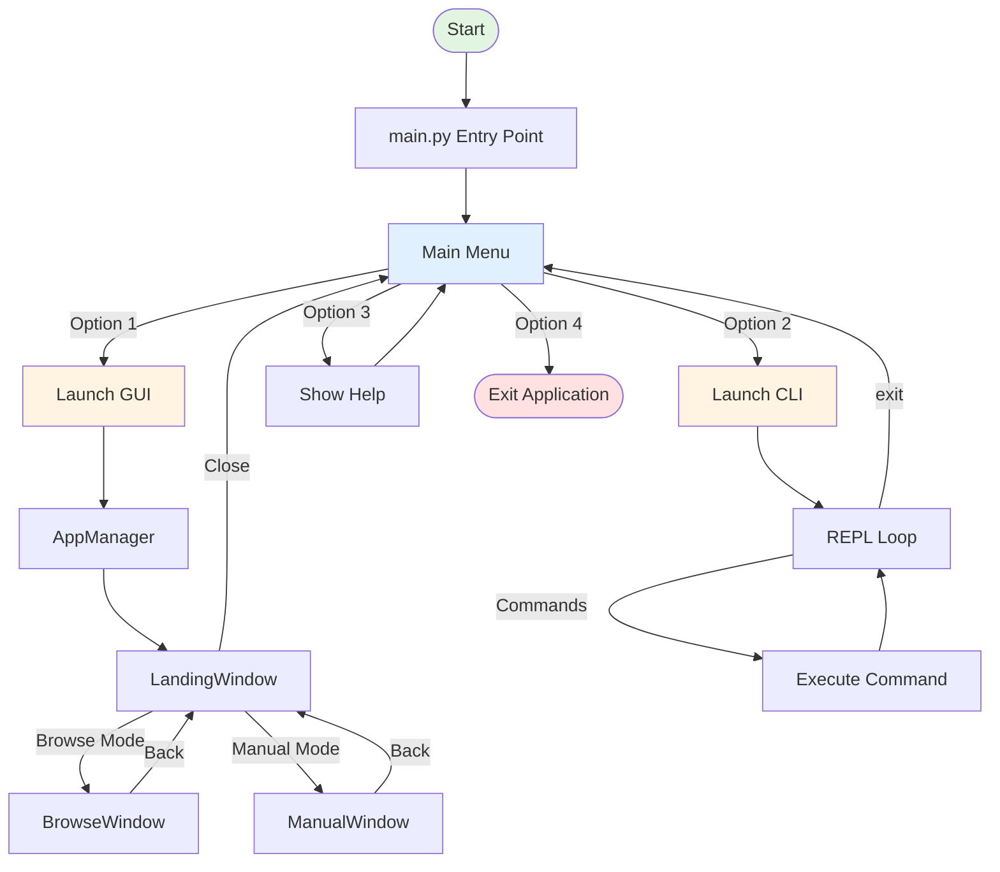

# SocialX XML Editor

<div align="center">


</div>

A professional XML editor and visualizer for social network data with dual interface support (GUI and CLI). Parse, validate, format, compress, and analyze XML files with powerful graph visualization capabilities.


## Table of Contents

- [Features](#features)
- [Screenshots](#screenshots)
- [Architecture](#architecture)
- [Installation](#installation)
- [Usage](#usage)
- [Project Structure](#project-structure)
- [Dependencies](#dependencies)
- [Examples](#examples)
- [Contributing](#contributing)
- [License](#license)

## Features

- **XML Processing**
  - Parse and tokenize XML strings
  - Validate XML structure with error detection
  - Auto-correct XML errors (missing tags, mismatched tags)
  - Format XML with intelligent indentation (4 spaces per level)
  - Minify XML by removing unnecessary whitespace
  - Compress/decompress XML using custom binary encoding

- **Data Transformation**
  - Convert XML to JSON format
  - Export structured data for external processing

- **Social Network Analysis**
  - Build directed graphs from XML social network data
  - Visualize network graphs with interactive layouts
  - Find most active users (highest post count)
  - Identify most influential users (highest follower count)
  - Discover mutual followers between multiple users
  - Get friend suggestions based on network topology

- **Search Capabilities**
  - Search posts by keyword
  - Search posts by topic

- **Dual Interface**
  - **GUI Mode**: Modern PySide6-based graphical interface with animated backgrounds
  - **CLI Mode**: Interactive REPL with bash-style prompt and comprehensive command set

## Architecture

The application follows a layered architecture pattern with clear separation between presentation, application logic, and data access layers.



### Component Overview

- **Presentation Layer**: GUI windows (`src/ui/`) and CLI interface (`cli.py`)
- **Application Layer**: Controllers (`src/controllers/`) managing business logic
- **Business Logic Layer**: Core algorithms for XML processing and graph analysis
- **Data Access Layer**: File I/O utilities (`src/utils/file_io.py`)


## Screenshots

### Main Entry Point


## Installation

### Prerequisites

- Python 3.8 or higher
- pip (Python package manager)

### Steps

1. **Clone the repository**
   ```bash
   git clone <repository-url>
   cd SocialX_Xml_Editor
   ```

2. **Install dependencies**
   ```bash
   pip install -r requirements.txt
   pip install colorama  # Required for CLI colors
   ```

3. **Verify installation**
   ```bash
   python main.py
   ```
   You should see the main menu with options to launch GUI or CLI.

### Build Windows .exe (PyInstaller)

If you're on Windows and want a bundled executable:

1. From the project root run:
   ```bash
   .\Builder.bat
   ```
2. The script will install build dependencies (`PySide6`, `networkx`, `matplotlib`, `numpy`, `colorama`, `pyinstaller`), clean previous `build/` and `dist/` outputs, and invoke PyInstaller.
3. The generated executable will be at `dist\SocialX.exe` with the app icon from `assets\icon.ico`.

## Usage

### GUI Mode

Launch the graphical user interface:

```bash
python main.py
# Select option 1
```


**Navigation:**
- **Landing Window**: Choose between Browse Mode or Manual Mode
- **Browse Mode**: Load XML files from disk and process them
- **Manual Mode**: Paste XML content directly into the editor

**Available Operations:**
- Check XML Errors
- Fix XML Errors
- Format XML
- Compress XML
- Decompress to XML
- Minify XML
- XML to JSON
- Explore Network (graph visualization)
- Post Search

### CLI Mode

Launch the command-line interface in REPL mode:

```bash
python main.py
# Select option 2
```


Or run CLI directly:

```bash
python cli.py
```

**Available Commands:**

| Command | Description | Example |
|---------|-------------|---------|
| `verify` | Verify XML structure | `verify -i input.xml [-o output.xml] [-f]` |
| `format` | Format XML file | `format -i input.xml [-o output.xml]` |
| `json` | Convert XML to JSON | `json -i input.xml [-o output.json]` |
| `mini` | Minify XML (remove spaces) | `mini -i input.xml [-o output.xml]` |
| `compress` | Compress XML file | `compress -i input.xml -o output.compressed` |
| `decompress` | Decompress XML file | `decompress -i input.compressed [-o output.xml]` |
| `search` | Search in posts | `search -i input.xml [-w word] [-t topic]` |
| `most_active` | Find most active user | `most_active -i input.xml` |
| `most_influencer` | Find most influential user | `most_influencer -i input.xml` |
| `mutual` | Find mutual followers | `mutual -i input.xml -ids "1,2,3"` |
| `suggest` | Suggest friends | `suggest -i input.xml -id user_id` |
| `draw` | Draw social network graph | `draw -i input.xml -o graph.png` |

**Special REPL Commands:**
- `help` - Show command help
- `clear` - Clear terminal screen
- `exit` / `quit` / `q` - Exit REPL

### Direct CLI Execution

Run single commands without entering REPL:

```bash
python cli.py verify -i assets/samples/file.xml -o verified.xml
python cli.py format -i assets/samples/file.xml -o formatted.xml
python cli.py draw -i assets/samples/file.xml -o graph.png
```

## Project Structure

```
xml-editor/
├── main.py                 # Application entry point
├── gui.py                  # GUI application manager
├── cli.py                  # CLI interface and REPL
├── requirements.txt        # Python dependencies
├── LICENSE                 # MIT License
│
├── src/
│   ├── __init__.py
│   │
│   ├── controllers/       # Business logic controllers
│   │   ├── xml_controller.py      # XML processing logic
│   │   └── graph_controller.py    # Graph analysis logic
│   │
│   ├── ui/                 # GUI components
│   │   ├── landing_window.py           # Main landing page
│   │   ├── browse_window.py             # File browser mode
│   │   ├── manual_window.py             # Manual input mode
│   │   ├── base_xml_window.py           # Base XML window class
│   │   ├── code_viewer_window.py       # Code display window
│   │   └── graph_visualization_window.py # Graph visualization
│   │
│   └── utils/              # Utility modules
│       ├── file_io.py              # File operations
│       ├── token_utils.py           # XML tokenization
│       ├── xml_tree.py              # XML tree structure
│       ├── binary_utils.py          # Compression utilities
│       ├── data_parser.py           # Data extraction
│       └── network_analyzer.py      # Graph algorithms
│
├── assets/
│   ├── images/             # Application images
│   └── samples/            # Sample XML files
│
├── output_samples/         # Generated output files
└── tests/                  # Test suite
    └── xml_controller_test.py
```

## Dependencies

| Package | Version | Purpose |
|---------|---------|---------|
| `PySide6` | >=6.0.0 | GUI framework |
| `networkx` | >=2.6.0 | Graph data structures and algorithms |
| `numpy` | >=1.20.0 | Numerical operations |
| `matplotlib` | >=3.5.0 | Graph visualization |
| `colorama` | * | Terminal colors (CLI) |

## Examples

### Example 1: Validate and Fix XML

```bash
# CLI Mode
python cli.py verify -i assets/samples/Sample_with_errors.xml -o fixed.xml -f

# This will:
# 1. Read the XML file
# 2. Detect structural errors
# 3. Auto-correct missing/mismatched tags
# 4. Write corrected XML to fixed.xml
```

### Example 2: Format XML

```bash
python cli.py format -i assets/samples/Non_formatted_sample.xml -o formatted.xml
```


### Example 3: Convert to JSON

```bash
python cli.py json -i assets/samples/Project_description_sample.xml -o output.json
```

### Example 4: Analyze Social Network

```bash
# Find most active user
python cli.py most_active -i assets/samples/Large_size_sample.xml

# Find most influential user
python cli.py most_influencer -i assets/samples/Large_size_sample.xml

# Find mutual followers between users 1, 2, and 3
python cli.py mutual -i assets/samples/Large_size_sample.xml -ids "1,2,3"

# Get friend suggestions for user 1
python cli.py suggest -i assets/samples/Large_size_sample.xml -id 1

# Visualize the network
python cli.py draw -i assets/samples/Large_size_sample.xml -o network_graph.png
```


### Example 5: Search Posts

```bash
# Search by keyword
python cli.py search -i assets/samples/Large_size_sample.xml -w technology

# Search by topic
python cli.py search -i assets/samples/Large_size_sample.xml -t programming
```

### Example 6: Compress XML

```bash
# Compress XML file
python cli.py compress -i assets/samples/Large_size_sample.xml -o compressed.bin

# Decompress back to XML
python cli.py decompress -i compressed.bin -o decompressed.xml
```

## Contributing

Contributions are welcome! Please follow these guidelines:

1. Fork the repository
2. Create a feature branch (`git checkout -b feature/amazing-feature`)
3. Commit your changes (`git commit -m 'Add some amazing feature'`)
4. Push to the branch (`git push origin feature/amazing-feature`)
5. Open a Pull Request

### Development Setup

1. Install development dependencies:
   ```bash
   pip install -r requirements.txt
   pip install colorama
   ```

2. Run tests:
   ```bash
   python -m pytest tests/
   ```

3. Follow PEP 8 style guidelines for Python code

## License

This project is licensed under the MIT License - see the [LICENSE](LICENSE) file for details.

---
